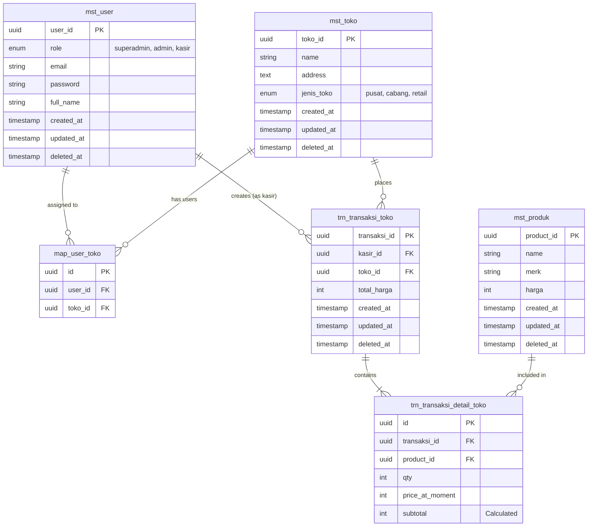

<p align="center"><a href="https://laravel.com" target="_blank"></a></p>

# Dokumentasi API Manajemen Toko

## 📖 Gambaran Umum (Overview)

**Manajemen Toko API** adalah layanan RESTful berbasis Laravel yang dirancang untuk mengelola operasi toko, pengguna, produk, dan transaksi. Sistem ini menerapkan arsitektur yang bersih dan aman dengan autentikasi JWT serta kontrol akses berbasis peran (RBAC).

### ✨ Fitur Utama

- **Autentikasi JWT**: Keamanan berbasis token yang kuat.
- **Kontrol Akses Berbasis Peran (RBAC)**: 
  - **Superadmin**: Akses penuh ke seluruh sistem.
  - **Admin**: Mengelola toko yang ditugaskan dan produk.
  - **Kasir**: Melakukan transaksi dan melihat riwayat di toko yang ditugaskan.
- **Manajemen Toko**: CRUD lengkap untuk toko (pusat, cabang, retail).
- **Manajemen Produk**: Pengelolaan data produk terpusat.
- **Transaksi**: Pencatatan transaksi penjualan dengan detail item.
- **Penugasan Pengguna**: Fleksibilitas assignment user (admin/kasir) ke banyak toko (many-to-many).
- **Soft Deletes**: Keamanan data dengan fitur penghapusan sementara.

### 🛠 Teknologi yang Digunakan

- **Framework**: Laravel 11.x
- **Bahasa**: PHP 8.2+
- **Database**: SQLite (dapat dikonfigurasi ke MySQL/PostgreSQL)
- **Autentikasi**: `tymon/jwt-auth`
- **Testing**: PHPUnit

---

## 🏗 Arsitektur Sistem

API ini dibangun menggunakan pola desain **Repository-Service** untuk memastikan pemisahan tanggung jawab (Separation of Concerns) yang baik, kode yang mudah diuji (testable), dan mudah dipelihara (maintainable).

```mermaid
graph TB
    Client[Klien (Web/Mobile)]
    Routes[Routing Layer]
    Middleware[Middleware (Auth & RBAC)]
    Controllers[Controller Layer]
    Services[Service Layer (Business Logic)]
    Repositories[Repository Layer (Data Access)]
    Models[Eloquent Models]
    Database[(Database)]
    
    Client -->|HTTP Request| Routes
    Routes --> Middleware
    Middleware -->|Verified Request| Controllers
    Controllers --> Services
    Services --> Repositories
    Repositories --> Models
    Models --> Database
    
    Database -->|Data| Models
    Models -->|Objects| Repositories
    Repositories -->|Domain Objects| Services
    Services -->|DTO/Results| Controllers
    Controllers -->|JSON Response| Client
```

### Flow Request
1. **Route & Middleware**: Menangani routing dan memvalidasi autentikasi/otorisasi.
2. **Controller**: Menerima input, memanggil service, dan mengembalikan response JSON standar.
3. **Service**: Menangani logika bisnis, validasi kompleks, dan transaksi database.
4. **Repository**: Menangani query database dan abstraksi data.

---

## 🗄 Skema Database (ERD)

Berikut adalah diagram relasi entitas (ERD) dari sistem Manajemen Toko:



---

## 🔌 Endpoint API

Base URL: `http://localhost:8000/api/v1`

### 1. Autentikasi (Authentication)

| Endpoint | Method | Deskripsi | Akses |
|----------|--------|-----------|-------|
| `/auth/login` | POST | Masuk dan mendapatkan token JWT | Public |
| `/auth/logout` | POST | Keluar dan invalidasi token | Authenticated |
| `/auth/me` | GET | Mendapatkan data user yang sedang login | Authenticated |
| `/auth/register` | POST | Mendaftarkan user baru | Superadmin, Admin (create kasir only) |
| `/auth/users` | GET | List semua user | Superadmin |
| `/auth/users/{id}` | PUT | Update data user | Authenticated (self), Superadmin |

### 2. Manajemen Toko (Store Management)

| Endpoint | Method | Deskripsi | Akses |
|----------|--------|-----------|-------|
| `/toko` | GET | List semua toko | Superadmin, Admin |
| `/toko` | POST | Membuat toko baru | Superadmin |
| `/toko/{id}` | GET | Detail toko | Authenticated |
| `/toko/{id}` | PUT | Update toko | Superadmin |
| `/toko/{id}` | DELETE | Hapus toko (soft delete) | Superadmin |
| `/toko/{id}/assign` | POST | Assign user ke toko | Superadmin, Admin |
| `/toko/{id}/users/{uid}` | DELETE | Hapus user dari toko | Superadmin, Admin |
| `/my-toko` | GET | List toko milik user login | Authenticated |

### 3. Manajemen Produk (Product Management)

| Endpoint | Method | Deskripsi | Akses |
|----------|--------|-----------|-------|
| `/products` | GET | List semua produk | Authenticated |
| `/products` | POST | Tambah produk baru | Superadmin, Admin |
| `/products/{id}` | GET | Detail produk | Authenticated |
| `/products/{id}` | PUT | Update produk | Superadmin, Admin |
| `/products/{id}` | DELETE | Hapus produk | Superadmin, Admin |

### 4. Transaksi (Transactions)

| Endpoint | Method | Deskripsi | Akses |
|----------|--------|-----------|-------|
| `/transactions` | POST | Buat transaksi baru | Authenticated |
| `/transactions` | GET | Riwayat transaksi | Authenticated (Filtered by Role) |
| `/transactions/summary` | GET | Ringkasan penjualan per toko | Authenticated (Filtered by Role) |

---

## 🚀 Instalasi & Setup

Ikuti langkah-langkah berikut untuk menjalankan aplikasi di lokal:

### Prasyarat
- PHP >= 8.2
- Composer
- SQLite (atau database lain)

### Langkah-langkah

1. **Clone Repository**
   ```bash
   git clone https://github.com/username/manajemen-toko.git
   cd manajemen-toko
   ```

2. **Install Dependencies**
   ```bash
   composer install
   ```

3. **Setup Environment**
   Salin file `.env.example` ke `.env`:
   ```bash
   cp .env.example .env
   ```
   Atur konfigurasi database di `.env`:
   ```ini
   DB_CONNECTION=sqlite
   # Hapus baris DB_DATABASE dll jika menggunakan sqlite default
   ```
   Buat file database SQLite (jika belum ada):
   ```bash
   touch database/database.sqlite
   ```

4. **Generate Key & JWT Secret**
   ```bash
   php artisan key:generate
   php artisan jwt:secret
   ```

5. **Migrasi Database**
   ```bash
   php artisan migrate
   ```

6. **Jalankan Server**
   ```bash
   php artisan serve
   ```
   Aplikasi akan berjalan di `http://localhost:8000`.

---

## 🧪 Pengujian (Testing)

Aplikasi ini dilengkapi dengan unit test menggunakan PHPUnit.

**Jalankan semua test:**
```bash
php artisan test
```

**Jalankan test spesifik:**
```bash
php artisan test --filter=AuthControllerTest
```

---

## 📝 Contoh Penggunaan (cURL)

**Login:**
```bash
curl -X POST http://localhost:8000/api/v1/auth/login \
  -H "Content-Type: application/json" \
  -d '{"email":"superadmin@example.com", "password":"password"}'
```

**Get Toko:**
```bash
curl -X GET http://localhost:8000/api/v1/toko \
  -H "Authorization: Bearer <your_token>"
```

---
Dibuat dengan ❤️ oleh Tim Manajemen Toko
